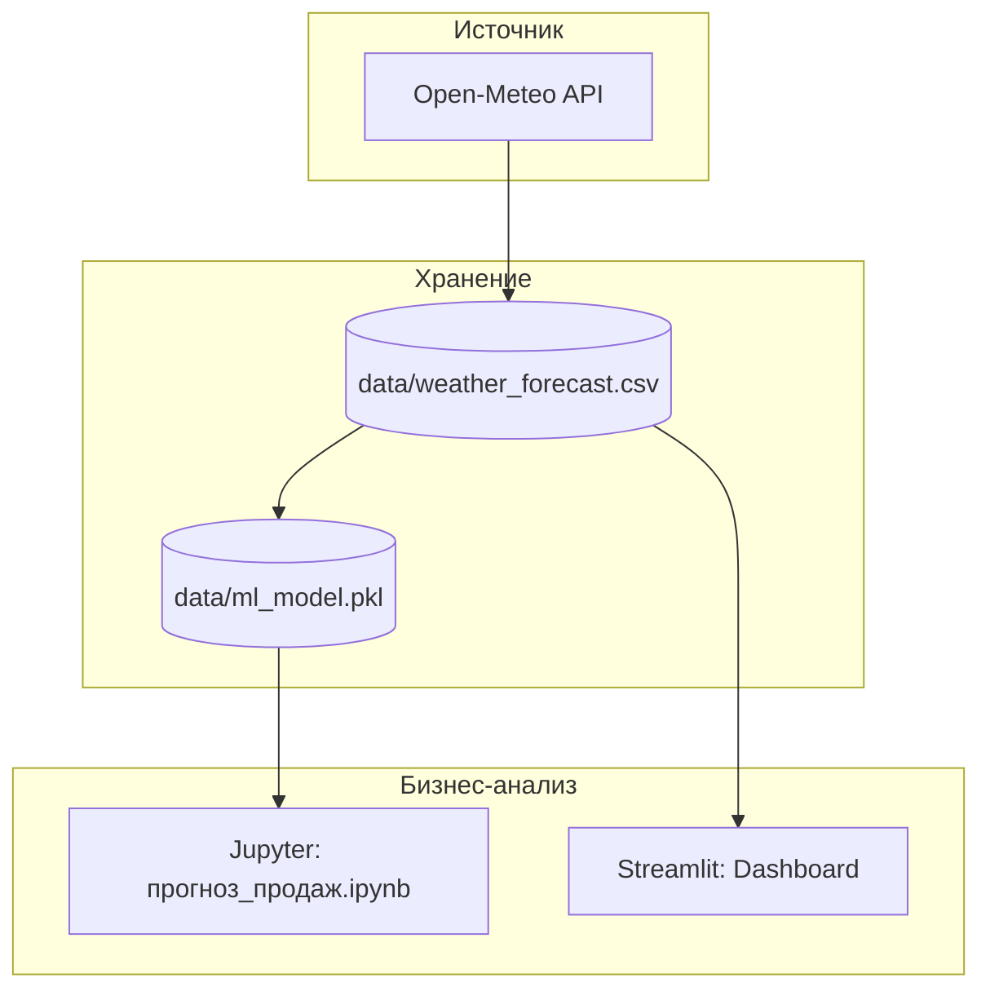

# Отчет по выполнению практической работы: "Создание ETL-конвейеров в Apache Airflow"

**Студент:** Семеняченко Д.Ю.  
**Вариант:** 18 (Стокгольм, 3 дня, удаление дубликатов, таблица Дата — Температура)

---

## 1. Подготовка среды
Среда развернута с помощью Docker. Собрана конфигурация на базе образа `custom-airflow:slim-2.8.1-python3.11`.
Основные сервисы:
- `postgres`: База данных Airflow.
- `webserver`: Интерфейс управления DAG-ами.
- `scheduler`: Планировщик задач.
- `streamlit`: Дашборд для визуализации результатов.

---

## 2. Архитектура решения
Архитектура включает источник данных (Open-Meteo), хранилище (Docker Volumes с CSV-файлами и ML-моделью) и слой аналитики (Jupyter + Streamlit).



---

## 3. Изучение Airflow (Graph View)
В модельном кейсе `01_umbrella.py` (заменен на `variant_18.py`) используется последовательно-параллельная логика:
- **Разделение**: Параллельный сбор данных о погоде и продажах.
- **Объединение**: Задача `join_data` собирает данные в единый датасет.
- **Обучение**: Задача `train_model` генерирует файл `.pkl`.

---

## 4. Реализация Варианта 18 (Стокгольм)
### Задание 1: Сбор данных
Настроен сбор прогноза для Стокгольма (59.33, 18.06) на 3 дня.
### Задание 2: Трансформация
Реализовано удаление дубликатов в функции `transform_weather_data`:
```python
df = df.drop_duplicates().reset_index(drop=True)
```
### Задание 3: Сохранение
Данные сохранены в файл `data/weather_forecast.csv` и выведены в лог в виде таблицы "Дата — Температура".

---

## 5. Прогнозирование продаж (ML)
В ноутбуке `прогноз_продаж.ipynb` реализована загрузка модели и расчет прогноза. На основе средней температуры для Стокгольма (5.5°C) модель рассчитала ожидаемый объем продаж.

---

## 6. Выводы
В результате работы был создан полностью функциональный ETL-тракт, очищенный от лишних файлов и настроенный под специфику 18-го варианта. Система готова к работе в промышленном контуре через Docker.
